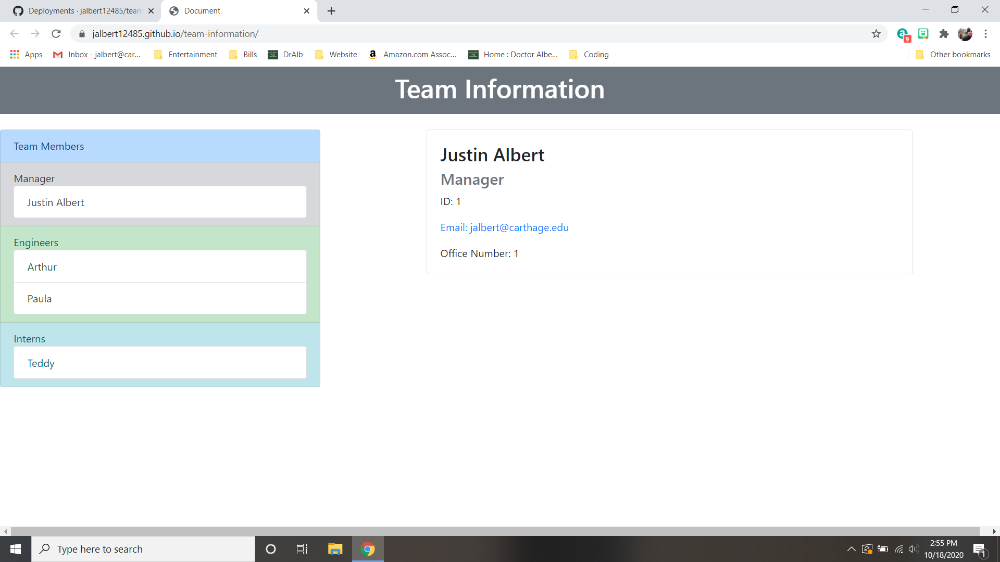

# Team Information 
## Table of Contents 
 * [About](#About) 
 * [Installation](#Installation) 
 * [Usage](#Usage) 
 * [Contributing](#Contributing) 
 * [License](#License) 
  
## About 
 In this project, we will use a node js program that allows the user to add, remove or display team members on his/her programming team.  After adding members information including name, role, id, email and role specific information, the program will generate an .html and .js file meant to nicely display the information for the user. 
  
## Installation 
 1. Clone this repository at [GitHub](https://github.com/jalbert12485/team-information.git) 
```sh 
git clone https://github.com/jalbert12485/team-information.git
 ``` 
2. Install packages using 
```sh 
npm i
 ``` 
 
## Usage 
 In order to use this program, you will need to access the app.js file using a node terminal.  You will then be prompted to add, remove, display team members or stop.  In order to add team members, you will be prompted for relevant information.  When you are done adding a member, your employee list will be saved to another file.  When running, you can also remove members from your list.  To do this, you will be required to enter the employee ID that you assigned that member.  Otherwise, if you would like to remove all employees and start over, you can type 'All' when prompted for an ID.  After adding or removing a team member, the program will begin again so that you can add or remove more members or display or stop.  Finally, you can display the information on a webpage.  When running app.js and choosing display, a script.js and index.html will be created.  If you open this index.html in a browser you will be able to view your list of team members.  In order to change the focused member, you need only click on the name of the employee you would like to see more detail of. 
## Contributing 
 If you would like to contribute to this package, please contact the author via [email](mailto:jalbert@carthage.edu).  Provide any details about your proposed chagnes so that your contribution can be made. 
## License 
 MIT License 
 
 Permission is hereby granted, free of charge, to any person obtaining a copy of this software and associated documentation files (the /'Software/'), to deal in the Software without restriction, including without limitation the rights to use, copy, modify, merge, publish, distribute, sublicense, and/or sell copies of the Software, and to permit persons to whom the Software is furnished to do so, subject to the following conditions: 
 
 The above copyright notice and this permission notice shall be included in all copies or substantial portions of the Software.  
  
 THE SOFTWARE IS PROVIDED 'AS IS', WITHOUT WARRANTY OF ANY KIND, EXPRESS OR IMPLIED, INCLUDING BUT NOT LIMITED TO THE WARRANTIES OF MERCHANTABILITY, FITNESS FOR A PARTICULAR PURPOSE AND NONINFRINGEMENT. IN NO EVENT SHALL THE AUTHORS OR COPYRIGHT HOLDERS BE LIABLE FOR ANY CLAIM, DAMAGES OR OTHER LIABILITY, WHETHER IN AN ACTION OF CONTRACT, TORT OR OTHERWISE, ARISING FROM,  OUT OF OR IN CONNECTION WITH THE SOFTWARE OR THE USE OR OTHER DEALINGS IN THE SOFTWARE. 
